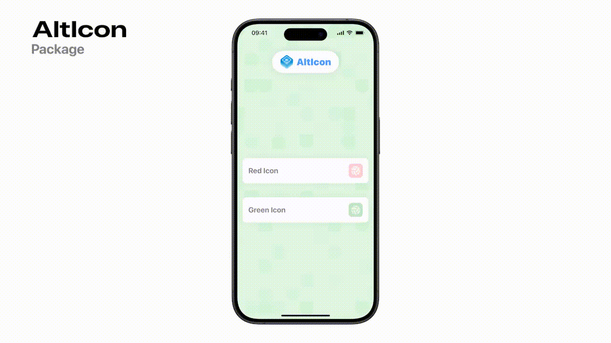

  
  <h2 align="center">
    AltIcon
  </h2>

- iOS 13.0+

A package that let's you change App Icon without an alert.

 

## Installation
To install AltIcon using [Swift Package Manager](https://github.com/apple/swift-package-manager) you can follow the [tutorial published by Apple](https://developer.apple.com/documentation/xcode/adding_package_dependencies_to_your_app) using the URL for this repo with the current version:

1. In Xcode, select “File” → “Add Packages...”
1. Enter `https://github.com/MassimoPalosciaIT/AltIcon.git`

## Usage
### Import Package
`import AltIcon`

### Set Alternative Icons
`setAppIcon(Icon("AppIcon2"))`

### Set Back Main Icon
`setAppIcon(.main)`

## Issues
Have an issue with using the runtime, or want to suggest a feature/API to help make your development life better? Log an issue in our issues tab! You can also browse older issues and discussion threads there to see solutions that may have worked for common problems.

 

> [!WARNING]  
> This package is using private Apple APIs. It's possible that Apple detects this during AppStore review process, so use at your own risk.

 

## Credits
Distributed under the MIT license. See **LICENSE** for more information.

Developed with ❤️ by Matt Novoselov
