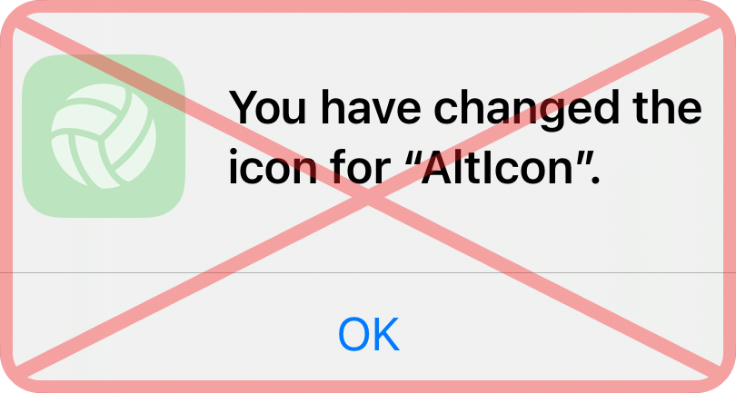

<p align="center">
  
  <h2 align="center">
    AltIcon
  </h2>
</p>


AltIcon - a better way to change icons in your app. This package allows you to change app icons without displaying an alert message.

<p align="center">
  
</p>


<br>

## Installation
To install AltIcon using [Swift Package Manager](https://github.com/apple/swift-package-manager) you can follow the [tutorial published by Apple](https://developer.apple.com/documentation/xcode/adding_package_dependencies_to_your_app) using the URL for this repo with the current version:

1. In Xcode, select “File” → “Add Packages...”
1. Enter `https://github.com/matt-novoselov/AltIcon.git`

## Usage
1. Add alternative icons to your `.xcassets` file.
2. Set `Include All App Icon Assets` to `YES` in your Build Settings.
3. Import AltIcon to your project:
   
```swift
import SwiftUI
import AltIcon

struct ContentView: View {
    var body: some View {
        
        Button("Set Alternative Icon") {
            setAppIcon("AppIcon2")
        }
        
        Button("Reset Icon To Default") {
            resetAppIcon()
        }
        
    }
}
```

## Issues
Have an issue with the package, or want to suggest a feature/API to help make your development life better? Log an issue in the issues tab! You can also browse older issues and discussion threads there to see solutions that may have worked for common problems.

<br>

> [!WARNING]  
> This package uses Apple's private APIs. AltIcon uses obfuscation, but there is a chance that Apple could detect this during the App Store review process. Use at your own risk.

<br>

## Credits
Distributed under the MIT license. See **LICENSE** for more information.

Developed with ❤️ by Matt Novoselov
